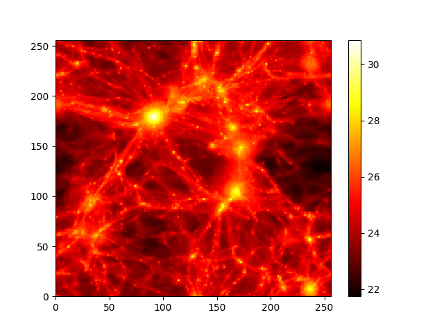

# cosmological-multifield-emulator
[Cosmological multifield emulator](https://arxiv.org/pdf/2402.10997)
をPyTorchで実装し、検証する。

## 環境構築
```bash
docker-compose up -d
```
足りないパッケージは自分でいれる（多く or 重く なってきたらビルド時に含めることも検討）。
```bash
pip install matplotlib tensorboard tqdm
```

## データセットのダウンロード
powershellではwgetが標準でなかったため、wsl経由のbashでwgetした。
```bash
cd {dataset_dir}
wget -r -l1 -A npy,txt https://users.flatironinstitute.org/~fvillaescusa/priv/DEPnzxoWlaTQ6CjrXqsm0vYi8L7Jy/CMD/2D_maps/data/
```
```txt
FINISHED --2024-05-06 21:52:24--
Total wall clock time: 7h 57m 26s
Downloaded: 201 files, 162G in 7h 56m 39s (5.80 MB/s)
```
約8時間かかった。

### 扱いやすくフォーマット
15,000枚×3のマップを分割して扱いやすいように保存する。
`utils.py`を変更して`extract_map`関数を実行する。pickleになる。
```python
# utils.pyを変更してextract_map関数を実行
if __name__ == '__main__':
    set_value = 'LH'
    map_paths = [
        f'dataset/Maps_Mgas_IllustrisTNG_{set_value}_z=0.00.npy',
        f'dataset/Maps_HI_IllustrisTNG_{set_value}_z=0.00.npy',
        f'dataset/Maps_B_IllustrisTNG_{set_value}_z=0.00.npy',
    ]
    params_path = f'dataset/params_{set_value}_IllustrisTNG.txt'
    out_dir = f'dataset/Maps_IllustrisTNG_{set_value}_z=0.00'
    
    extract_map(map_paths, params_path, out_dir)
```

## データセットついて

[データセットの説明](https://camels-multifield-dataset.readthedocs.io/en/latest/data.html)を参照。  
命名規則は`Maps_prefix_suite_set_z=0.00.npy`を標準とする。

### `prefix` の選択肢
Fieldの選択をprefixにより行う。

今回の実験では、`Mgas`(Gass Ddensity)と`HI`(Neutral hydrogen density)と`B`(Magnetic fields)をデータセットとして用いる。

| Field                    | Prefix  |
| ------------------------ | ------- |
| Gas density              | `Mgas`  |
| Gas velocity             | `Vgas`  |
| Gas temperature          | `T`     |
| Gas pressure             | `P`     |
| Gas metallicity          | `Z`     |
| Neutral hydrogen density | `HI`    |
| Electron number density  | `ne`    |
| Magnetic fields          | `B`     |
| Magnesium over Iron      | `MgFe`  |
| Dark matter density      | `Mcdm`  |
| Dark matter velocity     | `Vcdm`  |
| Stellar mass density     | `Mstar` |
| Total matter density     | `Mtot`  |

### `suite` の選択肢
	
Magnetic fieldsは`IllustrisTNG`のみのデータとなるため、`IllustrisTNG`のみを使用する。
- `IllustrisTNG`
- `SIMBA`
- `Astrid`
- `Nbody_IllustrisTNG`
- `Nbody_SIMBA`
- `Nbody_Astrid`

#### 各`suite`の説明
CMD has been generated from thousands of state-of-the-art (magneto-)hydrodynamic and gravity-only N-body simulations from the CAMELS project. CMD data can be classified into different suites, that indicate the type of simulation used to create the data:

CMD は、CAMELS プロジェクトによる何千もの最先端の (磁気) 流体力学および重力のみの N 体シミュレーションから生成されました。 CMD データは、データの作成に使用されるシミュレーションのタイプを示すさまざまなスイートに分類できます。

- `IllustrisTNG`. These magneto-hydrodynamic simulations follow the evolution of gas, dark matter, stars, and black-holes. They also simulate magnetic fields. CMD uses 1,088 of these simulations.
  - これらの磁気流体力学シミュレーションは、ガス、暗黒物質、星、ブラックホールの進化を追跡します。また、磁場もシミュレートします。 CMD はこれらのシミュレーションのうち 1,088 を使用します。

- `SIMBA`. These hydrodynamic simulations follow the evolution of gas, dark matter, stars, and black-holes. CMD uses 1,088 of these simulations.
  - これらの流体力学シミュレーションは、ガス、暗黒物質、星、ブラックホールの進化を追跡します。 CMD はこれらのシミュレーションのうち 1,088 を使用します。

- `Astrid`. These hydrodynamic simulations follow the evolution of gas, dark matter, stars, and black-holes. CMD uses 1,088 of these simulations.
  - これらの流体力学シミュレーションは、ガス、暗黒物質、星、ブラックホールの進化を追跡します。 CMD はこれらのシミュレーションのうち 1,088 を使用します。

- `N-body`. These gravity-only N-body simulation only follow the evolution of dark matter. Thus, they do not model astrophysical processes such as the formation of stars and the feedback from black-holes. There is an N-body simulation for each (magneto-)hydrodynamic simulation. CMD uses 2,000 of these simulations.
  - これらの重力のみの N 体シミュレーションは、暗黒物質の進化のみを追跡します。したがって、星の形成やブラックホールからのフィードバックなどの天体物理学的プロセスはモデル化されていません。 (磁気) 流体力学シミュレーションごとに N 体シミュレーションがあります。 CMD はこれらのシミュレーションを 2,000 使用します。

### `set` の選択肢
- `1P`
- `CV`
- `LH`

#### 各`sets`の説明
Each suite contains different sets, that indicate how the value of the labels of the underlying simulations are organized:

各スイートには、基礎となるシミュレーションのラベルの値がどのように構成されているかを示す異なるセットが含まれています。

- `CV`. The value of the labels is always the same and correspond to the fiducial model. The 2D maps and 3D grids only differ on the initial conditions of the simulations run. This set contains 27 simulations.
  - ラベルの値は常に同じであり、基準モデルに対応します。 2D マップと 3D グリッドは、実行されるシミュレーションの初期条件においてのみ異なります。このセットには 27 のシミュレーションが含まれています。

- `1P`. The value of the labels is varied one-at-a-time. I.e. the 2D maps and 3D grids have labels whose value only differ in one element from the value of the fiducial maps (CV set). In this case, the initial conditions are always the same. This set contains 61 simulations.
  - ラベルの値は一度に 1 つずつ変更されます。つまり、 2D マップと 3D グリッドにはラベルがあり、その値は基準マップ (CV セット) の値と 1 つの要素のみが異なります。この場合、初期条件は常に同じです。このセットには 61 のシミュレーションが含まれています。

- `LH`. The value of all labels is different in each simulation and the values are organized in a latin-hypercube. The value of the initial conditions is different in each simulation. This set contains 1,000 simulations.
  - すべてのラベルの値はシミュレーションごとに異なり、値はラテンハイパーキューブに編成されます。初期条件の値はシミュレーションごとに異なります。このセットには 1,000 のシミュレーションが含まれています。

- `EX`. The value of the labels is chosen to be extreme and the initial conditions of the simulations are the same. This set contains 4 simulations.
  - ラベルの値は極端になるように選択され、シミュレーションの初期条件は同じです。このセットには 4 つのシミュレーションが含まれています。

- `BE`. The underlying simulations have the same initial conditions and the same value of the labels (the fiducial ones). The only difference between the simulations is due to random noise from numerical approximations. This set contains 27 simulations. So far, this set is only present for the IllutrisTNG suite.
  - 基礎となるシミュレーションには、同じ初期条件と同じラベル (基準ラベル) の値があります。シミュレーション間の唯一の違いは、数値近似によるランダム ノイズによるものです。このセットには 27 のシミュレーションが含まれています。今のところ、このセットは IllutrisTNG スイートにのみ存在します。

### 各フィールドのパラメータ
`.txt`にある。

### 実験に用いたデータ一覧
| Path                                         | Shape             |
| -------------------------------------------- | ----------------- |
| dataset/Maps_B_IllustrisTNG_1P_z=0.00.npy    | (990, 256, 256)   |
| dataset/Maps_B_IllustrisTNG_BE_z=0.00.npy    | (405, 256, 256)   |
| dataset/Maps_B_IllustrisTNG_CV_z=0.00.npy    | (405, 256, 256)   |
| dataset/Maps_B_IllustrisTNG_EX_z=0.00.npy    | (60, 256, 256)    |
| dataset/Maps_B_IllustrisTNG_LH_z=0.00.npy    | (15000, 256, 256) |
| dataset/Maps_HI_IllustrisTNG_1P_z=0.00.npy   | (990, 256, 256)   |
| dataset/Maps_HI_IllustrisTNG_BE_z=0.00.npy   | (405, 256, 256)   |
| dataset/Maps_HI_IllustrisTNG_CV_z=0.00.npy   | (405, 256, 256)   |
| dataset/Maps_HI_IllustrisTNG_EX_z=0.00.npy   | (60, 256, 256)    |
| dataset/Maps_HI_IllustrisTNG_LH_z=0.00.npy   | (15000, 256, 256) |
| dataset/Maps_Mgas_IllustrisTNG_1P_z=0.00.npy | (990, 256, 256)   |
| dataset/Maps_Mgas_IllustrisTNG_BE_z=0.00.npy | (405, 256, 256)   |
| dataset/Maps_Mgas_IllustrisTNG_CV_z=0.00.npy | (405, 256, 256)   |
| dataset/Maps_Mgas_IllustrisTNG_EX_z=0.00.npy | (60, 256, 256)    |
| dataset/Maps_Mgas_IllustrisTNG_LH_z=0.00.npy | (15000, 256, 256) |

## データセットの扱い方と表示
`.npy`形式のファイルの中身は`(n, 256, 256)`のndarrayだった（少なくとも、`Mgas`, `HI`, `B`については）。  
1次元目で１枚取り出して、対数（底は10）を取って適当なカラーマップを用いてプロットすることで、論文のような画像が作れる。  


[公式実装サンプル(Colab)](https://colab.research.google.com/drive/1bT1OXxEPi2IaFs7sJn96M7scFtiKLygj?usp=sharing) があることがわかった。同じことをしていたため、問題ないことがわかった。


このプログラムは独自実装である。
```python
import numpy as np
import pathlib
import matplotlib.pyplot as plt

if __name__ == '__main__':
    print('playground')
    out_dir = pathlib.Path("dump/")
    out_dir.mkdir(parents=True, exist_ok=True)    
    
    def load_map0_and_plot(fmaps, cmap=plt.cm.hot, log=True):
        maps = np.load(fmaps)
        print(maps.shape)
        plt.clf()
        if log:
            maps[0] = np.log10(maps[0])
        plt.pcolor(maps[0], cmap=cmap)
        plt.colorbar() 
    
    fmaps = 'dataset/Maps_Mgas_IllustrisTNG_CV_z=0.00.npy'
    load_map0_and_plot(fmaps=fmaps, cmap=plt.cm.hot)
    plt.savefig(out_dir/"first_plot_Mgas_hot.png")
    
    fmaps = 'dataset/Maps_HI_IllustrisTNG_CV_z=0.00.npy'
    load_map0_and_plot(fmaps=fmaps, cmap=plt.cm.Greens)
    plt.savefig(out_dir/"first_plot_HI.png")
    
    fmaps = 'dataset/Maps_B_IllustrisTNG_CV_z=0.00.npy'
    load_map0_and_plot(fmaps=fmaps, cmap=plt.cm.cividis)
    plt.savefig(out_dir/"first_plot_B.png")
```

## プログラム構成について
実験のためのプログラム以下のものからなる
- model.py
  - モデル定義
- dataloader.py
  - データローダーのコード
- train.py
  - 学習のためのループ
- generate.py
  - 生成用コード

## モデルについて

## 実験
### 学習時コマンド
```bash
nohup python src/train.py > train_log.out &
```


## 2024 06 01 試験的に学習を行った実験について
当時時点のコードで300epoch学習を回した。  
結果として論文と同様の結果は得られなかったため、失敗と言える。  
収穫として、学習を安定化することが難しいという知見を得た。生成器、識別器の両Loss値の推移を見ると乱高下を繰り返しており、不安定であった。  
そのため、今後は学習安定化のための施策が必要であると考える。例えば、BatchNormalizeや入力値の正規化[-1, 1]などである。  
他にもGANを用いる際によく用いられる手法を組み込むことで安定化させたい。

## 学習安定化のためのTipsの実装
### Label Smoothing
正解ラベルを1や0ではなく0.9と0.1にすることで，極端な最適化を防ぐ．

### 識別器の入力と生成器の出力を[-1, 1]に正規化
sigmoidよりもtanhのほうが原点を含む分，分布として安定するらしい．

### 生成器の生成元となるノイズを一様分布ではなく正規分布
生成器に入力するノイズを正規分布にする．いいらしい．

## 論文を読んで、Loss関数に関する実装を追う
<details>
  <summary>vscode向け数式表示スクリプト</summary>
  <script type="text/javascript" async src="https://cdnjs.cloudflare.com/ajax/libs/mathjax/2.7.7/MathJax.js?config=TeX-MML-AM_CHTML"></script>
  <script type="text/x-mathjax-config">MathJax.Hub.Config({tex2jax:{inlineMath:[['$','$']],displayMath:[['$$','$$'],["\\[","\\]"]]}});</script>
</details>

### 識別器のLoss

### 生成器のLoss


## 参考文献リスト
- [PytorchでGANを実装してみた。](https://qiita.com/keiji_dl/items/45a5775a361151f9189d)をベースに実装すると素早く実装を終えられそう。
- [CMD 公式実装サンプル(Colab)](https://colab.research.google.com/drive/1bT1OXxEPi2IaFs7sJn96M7scFtiKLygj?usp=sharing)
- [CMD データセットの説明](https://camels-multifield-dataset.readthedocs.io/en/latest/data.html)
- [【基礎】PyTorchのDataLoader/Datasetの使い方【MNIST】](https://qiita.com/tetsuro731/items/d64b9bbb8de6874b7064)
- [PyTorch Datasets & DataLoaders](https://pytorch.org/tutorials/beginner/basics/data_tutorial.html)
- [[画像]Skip-layer excitationの構造について](https://www.researchgate.net/figure/The-structure-of-the-skip-layer-excitation-module-and-the-Generator-Yellow-boxes_fig3_348486394)
  - [[GitHub]公式実装 FastGAN-pytorch](https://github.com/odegeasslbc/FastGAN-pytorch/tree/main)
- [GAN(Generative Adversarial Networks)を学習させる際の14のテクニック](https://qiita.com/underfitting/items/a0cbb035568dea33b2d7)
  - 少し古いがGAN自体が古い手法であるので役に立つはず
- [GANのトレーニングに役立つ10のヒント](https://webbigdata.jp/post-9801/)